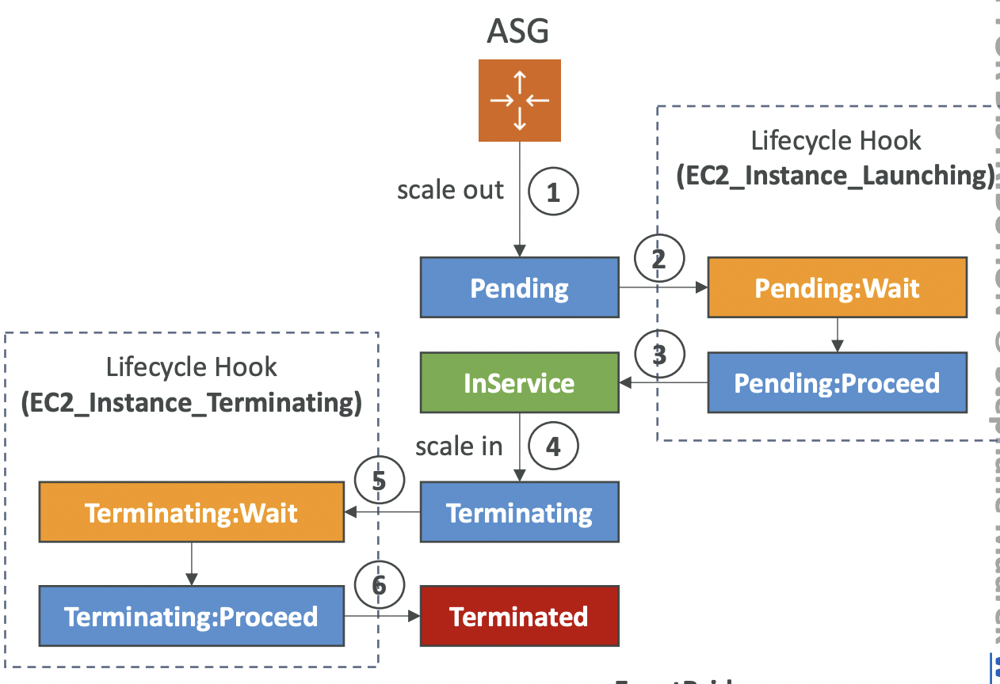

# Jottings

### 1. EC2 standard networking

- EC2 standard networking is the default network setup for EC2 instances, offering basic connectivity with moderate speed and higher latency compared to Enhanced Networking.

### 2. EC2 Enhanced Networking

- EC2 Enhanced Networking is a feature in AWS that makes your virtual server (EC2 instance) communicate faster and more efficiently over the network. It reduces delays, increases speed, and handles more data at once, making it great for applications that need high performance, such as big data processing or gaming servers.
- EC2 Enhanced Networking supports Elastic Network Adapter (ENA) and the legacy Intel 82599 VF (up to 10 Gbps).

### 3. Elastic Network Adapter

- Elastic Network Adapter (ENA) is a special network card for AWS EC2 instances that allows them to send and receive data faster (up to 100 Gbps) with lower delays. It helps applications that need high-speed networking, like video streaming, gaming, and big data processing.

### 4. Intel 82599 Virtual Function

- Intel 82599 Virtual Function (VF) is an older network adapter option for AWS EC2 instances that allows data transfer up to 10 Gbps. It provides better performance than standard networking but is considered legacy compared to the faster ENA (Elastic Network Adapter).

### 5. Elastic Fabric Adapter (EFA)

- Elastic Fabric Adapter (EFA) is a special version of Elastic Network Adapter (ENA) that makes Linux EC2 instances communicate even faster, especially for supercomputing and machine learning. While ENA boosts network speed, EFA takes it further by reducing delays and helping servers work together more smoothly.
- Enhanced Networking and EFA (Elastic Fabric Adapter) are separate features.
- Enhanced Networking (ENA or Intel 82599 VF) improves general network speed and performance.
- EFA is built on ENA but adds extra features for supercomputing, machine learning, and HPC workloads by reducing delays and improving communication between servers.

### 6. EC2 Placement Groups

- EC2 Placement Groups are like choosing where to sit in a restaurant—whether you want to be close to friends (for fast talking), spread out (for safety), or in a balanced spot (for a mix of both).
- EC2 Placement Groups are a way to organize your EC2 instances to control how they are placed on AWS servers, helping improve speed, reduce delays, or increase reliability.

### 7. Cluster Placement Group

- Groups instances close together within a single Availability Zone for low-latency, high-speed networking.

### 8. Spread Placement Group

- In a Spread Placement Group, each instance is placed on a separate hardware (rack). These racks can be in the same or different AZs. You can have a spread group that is limited to one AZ, but if spread across multiple AZs, it allows up to 7 instances per AZ.
  -If you launch 10 instances in a Spread Placement Group across 3 AZs, AWS might place: - 4 instances in AZ-1 (each on a separate rack) - 3 instances in AZ-2 (each on a separate rack) - 3 instances in AZ-3 (each on a separate rack)

### 9. What is a Partition?

- A partition is a group of hardwares (racks) not necessarily working together as teammates or collaborating to process workloads, but serving instances within that partition. They are isolated from other partitions to prevent failures from spreading.
- They exist within a single Availability Zone. You can have multiple partitions within the same AZ.

### 10. Partition Placement Groups

- Spreads instances across separate racks (partitions) within an Availability Zone, scaling up to hundreds of instances for big data applications (e.g., Hadoop, Cassandra, Kafka).
- If you create a Partition Placement Group in AZ-1 with 3 partitions, AWS might distribute instances like this:
  - Partition 1: Uses Rack A, Rack B, Rack C
  - Partition 2: Uses Rack D, Rack E, Rack F
  - Partition 3: Uses Rack G, Rack H, Rack I

### 11. Placement groups limitations

- Cluster Placement Group → No fixed limit, but all instances must be in the same AZ. Optimized for low-latency, high-speed networking. AWS recommends using homogeneous instance types for best performance.
- Spread Placement Group → Limited to 7 instances per Availability Zone. If using multiple AZs, you can have 7 instances per AZ (e.g., 21 instances if spread across 3 AZs). Each instance is placed on a separate rack for maximum fault tolerance.
- Partition Placement Group → No strict instance limit (can scale to hundreds of instances). You can have up to 7 partitions per AZ (default limit, but can be increased). Each partition can hold many instances (AWS distributes them across racks inside that partition).

### 12. Termination Protection

- Even with Termination Protection enabled, an instance will still terminate if shut down from within the OS(i.e sudo shutdown) if its Shutdown Behavior is set to "Terminate", but Termination Protection prevents deletion from the AWS Console, CLI, or API.
- Running sudo shutdown inside an EC2 instance will stop or terminate the instance based on its Shutdown Behavior setting:
  - If Shutdown Behavior = "Stop" → The instance stops (can be restarted later).
  - If Shutdown Behavior = "Terminate" → The instance terminates (permanently deleted).

### 13. What is a vCPU?

- A vCPU (virtual Central Processing Unit) is a logical CPU assigned to an EC2 instance. It represents a portion of a physical CPU's computing power and is used to process tasks within an instance. The number of vCPUs an instance has depends on its instance type (e.g., t3.micro has 2 vCPUs, while c5.24xlarge has 96 vCPUs).
- Launching the instance in a different region helps because vCPU limits are set per region, meaning the limit you reached applies only to the current region. If you switch to another region where you haven't hit the limit, you can launch the instance there without needing an immediate limit increase. However, this may introduce latency issues if your workload requires low-latency connections between regions.

### 14. What Makes vCPU Usage Increase?

- Launching More Instances → Each instance type has a fixed number of vCPUs, so more instances = more vCPUs used.
- Using Larger Instance Types → Bigger instances (e.g., m5.8xlarge) have more vCPUs than smaller ones (e.g., m5.large).
- Increasing Auto Scaling → If an Auto Scaling Group adds instances, the total vCPU count increases.
- Running On-Demand or Spot Instances → AWS tracks only running instances for vCPU limits (stopped instances don't count).

### 15. InstanceLimitExceeded error(your fault)

- The #InstanceLimitExceeded error occurs when you exceed the maximum allowed vCPUs for running instances in a region, which is based on AWS's vCPU-based limits for On-Demand and Spot instances.

### 16. InsufficientInstanceCapacity(aws fault)

- The #InsufficientInstanceCapacity error occurs when AWS lacks enough On-Demand capacity in a specific Availability Zone, and it can be resolved by waiting and retrying, splitting large requests into smaller ones, selecting a different instance type, or launching in another AZ.

### 17. Instance Terminates Immediately

- The Instance Terminates Immediately issue occurs when an EC2 instance goes from pending to terminated due to reasons like reaching the EBS volume limit, a corrupt EBS snapshot, missing permissions for an encrypted root EBS volume, or a store-backed AMI missing required files
- The exact cause can be found in the EC2 Console → Instances → Description tab → State transition reason label.

### 18 Private Key Permissions

- 400 permissions on a .pem file mean that only the file owner can read it, preventing unauthorized access and avoiding the "Unprotected private key file" SSH error.
- Ensure the .pem file has 400 permissions to avoid the "Unprotected private key file" error.

### 19. Corrrect OS username

- Using the correct OS username (e.g., ec2-user for Amazon Linux, ubuntu for Ubuntu) is essential for successful SSH login and to avoid errors like "Host key not found", "Permission denied", or "Connection closed by [instance] port 22"

### 20. Connection timed out Error

- A "Connection timed out" error when connecting to an EC2 instance via SSH can be caused by misconfigured Security Groups (SG) or NACLs, incorrect subnet route tables, missing public IPv4, or high CPU load on the instance.

### 21. SSH vs Instance Connect

- With SSH, you can only connect to an EC2 instance if your IP address is allowed in the Security Group, blocking others. EC2 Instance Connect lets you connect without changing security rules by temporarily adding a public key for access.
- Temporarily adding a public key means that EC2 Instance Connect pushes an SSH key to the EC2 instance for a short time (usually 60 seconds), allowing you to connect without permanently storing keys or modifying security rules.

### 22. EC2 Instance Connect

- EC2 Instance Connect works by temporarily pushing an SSH key to the instance using AWS's special IP range, which does not require the instance itself to have an IP from that range.
- However, for Instance Connect to succeed, the Security Group must allow inbound SSH (port 22) from AWS's special IP range. By default, new instances usually work with Instance Connect because they inherit a Security Group that permits SSH from 0.0.0.0/0, which includes AWS's IP range.
- If you modify the inbound rules to allow only your local PC's IP, Instance Connect will fail since AWS's special IP range is blocked.
- To keep both direct SSH and Instance Connect functional, you should allow SSH from both your local IP and AWS's special IP range in the Security Group.

### 23. Instance Price Predictability

- On-Demand Instances have fixed per-second or per-hour pricing, so you always know the cost upfront without long-term commitments(Reserved) or price changes(Spot).
- Reserved Instances pricing can be unpredictable if you commit to a term but later need different instance types, regions, or fewer instances, as the upfront payment is non-refundable and locked in.
- Spot Instances pricing is unpredictable because it changes based on supply and demand, meaning the cost can go up or down at any time, and AWS can terminate the instance if the price exceeds your bid.

### 24. Instances Usage

- Recommended for short term and un-interrupted workloads, where you can't predict how the application will behave.
- You can buy and sell Reserved Instances in Reserved Instance Marketplace if you dont need them anymore.
- Convertible Reserved Instances offer up to 66% discount and allow flexibility to change the EC2 instance type, family, OS, scope, and tenancy during the reservation period.

### 25. EC2 Spot Instances

- EC2 Spot Instances offer up to 90% cost savings compared to On-Demand but can be interrupted anytime if the Spot price exceeds your bid, making them ideal for batch jobs, data analysis, image processing, and flexible workloads, but not suitable for critical jobs or databases.

### 26. EC2 Dedicated Hosts

- EC2 Dedicated Hosts provide a fully dedicated physical server for your use, supporting BYOL (Bring Your Own License) and compliance requirements, but are the most expensive option, available On-Demand or Reserved (1 or 3 years).
- BYOL (Bring Your Own License) allows you to use your existing software licenses on AWS infrastructure.

### 27. Dedicated Instances Vs Dedicated Hosts

- Dedicated Instances → AWS reserves a physical server for your account, but AWS decides instance placement, and instances may move if stopped/started.
- Dedicated Hosts → AWS reserves a physical server for your account, but YOU control where instances are placed, ensuring they stay on the same host.
- This makes Dedicated Hosts ideal for BYOL (Bring Your Own License) scenarios, compliance needs, and workloads requiring manual instance placement.

### 28. EC2 Capacity Reservations

- EC2 Capacity Reservations guarantee On-Demand instance capacity in a specific Availability Zone (AZ) for any duration, with no time commitment or discounts, and you pay the On-Demand rate even if instances are not running, making them ideal for short-term, uninterrupted workloads needing capacity assurance.

### 29. EC2 Savings Plans

- EC2 Savings Plans give you big discounts (up to 72%) if you commit to spending a fixed amount per hour ($/hour) for 1 or 3 years, allowing flexibility in instance size, OS, and tenancy, but they are limited to a specific instance family and AWS region.
- If you always use EC2 and want discounts without being locked into specific instances, Savings Plans are a great choice
- EC2 Savings Plans give discounts based on a spending commitment ($/hour) but do not guarantee capacity—you save money but still depend on available EC2 instances.
- EC2 Capacity Reservations guarantee instance availability in a specific AZ but do not provide discounts—you pay On-Demand rates even if the instances are not running.

### 30. EC2 IPv4 750-hour free tier

- Starting February 1, 2024, AWS charges $0.005 per hour (~$3.6/month) for each Public IPv4, with a 750-hour free tier for new EC2 instances in the first 12 months, but no free tier for Load Balancers or RDS.

### 31. Cancelling a Spot Request

- To terminate Spot Instances, you must first cancel the Spot Request (if it is open, active, or disabled) and then manually terminate the running Spot Instances, as cancelling a Spot Request alone does not terminate the instances.

### 32. pot Fleet

- A Spot Fleet is a group of Spot Instances (and optional On-Demand Instances) that automatically finds the best-priced instances based on your settings, using different strategies to balance cost, availability, and performance.
- A Spot Fleet selects the best instance type and Availability Zone from multiple launch pools (e.g., m5.large in us-east-1a, m5.xlarge in us-east-1b, c5.large in us-east-1c) based on price and availability to maintain capacity at the lowest cost.

### 33. Launch pools

- Launch pools in a Spot Fleet are the different instance types, operating systems, and Availability Zones that the fleet can choose from when launching instances.
- A Spot Fleet checks all the launch pools and picks the best option based on your price and capacity preferences.
- If one pool becomes too expensive or unavailable, the fleet switches to another pool to maintain the requested capacity.
- This helps reduce costs while ensuring that enough instances are running for your workload.

### 34. Spot Request

- A Spot Request asks for a single Spot Instance, while a Spot Fleet requests and manages multiple Spot Instances across different instance types, AZs, and pricing strategies to optimize cost and availability.

### 35. EC2 burst balances

Think of EC2 burst balances as a savings account for CPU power. Your instance saves unused CPU capacity to spend later when it needs a performance boost.
EC2 burst balances represent the extra processing power your instance has stored up for short, high-performance tasks. They are like a "reserve energy tank" for your EC2 instance's CPU, allowing it to handle more work temporarily when needed.

### 36. Deployment Strategies

Immutable Updates: Deploys new instances in a separate group and switches traffic to them once they're ready. Old instances are terminated, leading to burst credit loss.
Traffic Splitting: Routes a percentage of traffic to newly created instances while gradually reducing traffic to the old ones. Once fully switched over, the old instances are terminated.
If you want to preserve EC2 burst balances during deployments, opt for in-place deployment strategies like Rolling or All-at-once, as they update existing instances without replacing them.

### 37. Understanding EC2 Burst Balance Loss During Deployments

If you notice EC2 burst balances are lost after a deployment, it is likely due to using immutable updates or traffic splitting mode, as these deployment strategies replace existing instances with new ones. To preserve burst balances, use in-place deployment strategies such as Rolling or All-at-once, which update existing instances instead of replacing them.

### 38. Burstable Instances

- Burstable Instances (T2/T3) run at normal CPU power but can boost performance ("burst") when needed using credits—if credits run out, the CPU slows down until new credits build up.
- T2/T3 instances are burstable EC2 instances that provide basic CPU performance but can temporarily boost ("burst") when needed using CPU credits, which accumulate when the instance is idle and deplete when high CPU power is used.
- As of now, T2, T3, T3a, and T4g are the only burstable instance types in AWS. These instances use CPU credits to provide temporary bursts of high performance when needed
- The Unlimited Mode for T2, T3, T3a, and T4g instances allows them to burst beyond their CPU credit limit without performance drops, but with additional charges if CPU usage stays high for too long.

### 39. Elastic IP

- An Elastic IP is a fixed public IPv4 address for an EC2 instance, which remains the same even if the instance stops and starts, can be remapped to another instance, and is free when attached but incurs charges when unused.

### 40. CloudWatch Metrics

- CloudWatch Metrics for EC2 include Basic Monitoring (free, 5-minute intervals) and Detailed Monitoring (paid, 1-minute intervals), tracking CPU, network, disk, and status checks.
- EC2 CloudWatch metrics include CPU usage, network traffic, status checks, and disk read/write, but do not track RAM usage, requiring custom metrics for memory monitoring.

### 41. EC2 CloudWatch metrics

- CPU Usage – Measures CPU utilization and burstable instance credit balance to track processing power.
- Network Traffic – Monitors incoming and outgoing network data to analyze bandwidth usage.
- Status Checks – Checks instance health, system hardware, and attached EBS volume status to detect issues.
- Disk Read/Write – Tracks read and write operations (Ops/Bytes) for instance store disks, but not for EBS volumes.

### 42. Custom CloudWatch metrics

- Custom CloudWatch metrics allow users to push their own data (e.g., RAM and application-level metrics) at 1-minute (basic) or 1-second (high) resolution, but require proper IAM permissions on the EC2 instance role.

### 43. Unified CloudWatch Agent

- By default, EC2 instances do not send logs to CloudWatch Logs, and you need the Unified CloudWatch Agent to collect and push system logs, as well as metrics like RAM and disk usage, which are not included in standard EC2 monitoring.
- It requires correct IAM permissions, supports centralized configuration via SSM Parameter Store, and uses CWAgent as the default namespace for collected metrics.
- The Unified CloudWatch Agent uses SSM Parameter Store to store and manage its settings in one place, so you can easily update and apply the same configuration to multiple instances.

### 44. Procstat plugin

- The procstat plugin in the Unified CloudWatch Agent monitors CPU, memory, and system utilization of individual processes on Linux and Windows. , and reports metrics with the "procstat" prefix (e.g., procstat_cpu_usage).
- Without the procstat plugin, you wouldn’t get process-level insights, making it harder to diagnose issues in complex applications.

### 45. Process-level insights

- Process-level insights provide detailed data on individual processes, including CPU and memory usage, uptime, resource spikes, and health status, helping identify and troubleshoot performance issues.
- EC2 standard monitoring in CloudWatch does not monitor process-level insights; it only tracks overall system metrics like CPU, disk, network, and instance status, but does not show which individual processes are using resources

### 46. AWS status checks

- AWS status checks help find and fix problems in EC2 instances by checking hardware, software settings, and storage health.
  - System Status Checks (SSC) → Check AWS hardware issues.
  - Instance Status Checks (ISC) → Check software and network issues inside the EC2 instance.
  - EBS Status Checks (ESC) → Check EBS volume (storage) health.

### 47. CloudWatch metrics and alarm

- CloudWatch metrics track EC2 instance health every minute, detecting system, instance, and EBS failures. If an issue is found, a CloudWatch Alarm can trigger recovery, keeping the same IP and settings while also sending notifications. Alternatively, an Auto Scaling Group can launch a new instance(set min/max/desired to 1), but it won’t retain the original IP.

### 48. Cloudwatch alarms

- CloudWatch Alarms can do more than just send notifications; they can trigger automated recovery actions for EC2 instances. If a system status check fails, CloudWatch can initiate EC2 instance recovery, which restarts the instance on new hardware while keeping the same private/public IP, EIP, and metadata. However, this works only for system failures and not for instance-level issues like OS crashes.

### 49. StatusCheckFailed_System

- CloudWatch monitors EC2 health using metrics like StatusCheckFailed_System and can trigger recovery actions. One option is using a CloudWatch Alarm to recover the instance with the same IP and metadata, while also sending notifications via SNS. Another option is using an Auto Scaling Group to launch a replacement instance, but it won’t retain the original private or Elastic IP.

### 50. EC2 statuscheck cloudwatch metrics

- Other Cloud watch metrics include StatusCheckFailed_System, StatusCheckFailed_Instance, StatusCheckFailed_AttachedEBS and StatusCheckFailed_Any.
- StatusCheckFailed_Any is a CloudWatch metric that triggers when either a system-level or instance-level status check fails. It combines both StatusCheckFailed_System (hardware or AWS infrastructure issues) and StatusCheckFailed_Instance (OS, network, or software issues), making it a useful metric for detecting overall instance health problems.

### 51. EC2 Hibernate

- EC2 Hibernate allows you to pause an instance while keeping its in-memory state, so when you start it again, everything resumes quickly without reloading the OS or applications, unlike stopping (which requires a full reboot) or terminating (which erases everything).

### 52. EC2 Image Builder

- EC2 Image Builder automates the creation, maintenance, validation, and testing of Amazon Machine Images (AMIs) for EC2 instances. It ensures AMIs are up-to-date, secure, and ready for deployment on a scheduled basis, reducing manual effort in managing VM or container images.
- EC2 Image Builder keeps AMIs up-to-date by automatically running scheduled builds that apply the latest updates, security patches, and configurations before validating and distributing the AMIs.

### 53. AMI

- AMIs are region-locked, meaning the same AMI ID cannot be used across different AWS regions.
- To migrate an EC2 instance to another Availability Zone (AZ), create an AMI from the existing instance and use it to launch a new EC2 instance in the desired AZ.

### 54. Sharing AMIs

- To allow another AWS account to use an AMI with an encrypted EBS snapshot, you must share the AWS KMS Customer Master Key (CMK) used for encryption with that account.

### 55. Using approved AMI

- To ensure that all EC2 instances are launched using the approved AMI, you can use AWS Config, which allows you to set compliance rules that monitor and enforce the use of the approved AMI.

### 56. AWS Systems Manager

- AWS Systems Manager helps you control and monitor your EC2 and on-premises servers, fix issues automatically, keep systems updated, and connect with CloudWatch and AWS Config for better tracking.

### 57. SSM agent

- AWS Systems Manager works by using the SSM agent, which must be installed on EC2 or on-premises servers (pre-installed on Amazon Linux 2 and some Ubuntu AMIs), and requires proper IAM permissions to function. If an instance cannot be controlled through SSM, the issue is likely due to a missing or misconfigured SSM agent or incorrect IAM role settings.

### 58. Resource Groups

- Resource Groups in AWS allow you to organize and manage multiple resources using tags, helping to group related resources such as applications, different layers of a stack, or production versus development environments, making it easier to manage infrastructure efficiently.

### 59. SSM Documents

- SSM Documents (SSM Docs) are JSON or YAML files that define automation actions, parameters, and commands for AWS Systems Manager, allowing users to execute predefined or custom tasks like software installation, patching, and configuration management on EC2 instances and other managed resources.
- In simple terms, they tell AWS what tasks to run on your servers, like installing software or updating settings, so you can manage them automatically.

### 60. SSM Automation

- SSM Automation helps automate common AWS tasks like restarting EC2 instances or creating backups using predefined or custom runbooks, which can be triggered manually, on a schedule, or by AWS services like EventBridge and AWS Config.

### 61. Runbooks

- Runbooks are a type of SSM Document specifically designed for automation tasks in AWS Systems Manager (SSM). They define the sequence of actions that should be executed on AWS resources, such as restarting an EC2 instance or taking an EBS snapshot.

### 62. SSM Parameter Store

- SSM Parameter Store securely stores configuration data and secrets, supports optional encryption with KMS, provides version tracking, integrates with AWS services like CloudFormation and EventBridge, and ensures access control through IAM.

### 63. SSM Parameter Store hierarchy

- The SSM Parameter Store hierarchy allows the organization of parameters into paths, such as by environment (e.g., dev, prod) or by department, and these parameters can be retrieved using APIs, like GetParameters or GetParametersByPath, to be used in different functions, such as Lambda functions for different environments.

### 64. Parameter tiers

- The Standard parameter tier in SSM Parameter Store is free and supports up to 10,000 parameters with a maximum size of 4 KB per parameter but does not allow parameter policies.
- The Advanced tier allows up to 100,000 parameters with a larger size limit of 8 KB per parameter and supports parameter policies but comes with a storage cost of $0.05 per parameter per month.
- The Advanced tier is useful when more storage, policies, and scalability are needed, while the Standard tier is best for basic, cost-free configurations.

### 65. Parameter policies

- Parameter policies in SSM Parameter Store allow you to set rules for advanced parameters, such as expiration to automatically delete parameters after a set time, expiration notifications to send alerts before parameters expire using EventBridge, and no change notifications to detect when parameters remain unchanged for a specified duration.

### 66. SSM Inventory

- SSM Inventory collects and stores metadata like software, updates, and configurations from EC2 or on-premises instances, allowing you to view, analyze, and query it across accounts and regions using tools like S3, Athena, or QuickSight.

### 67. SSM State Manager

- SSM State Manager helps you keep EC2 or on-premises instances in a specific, desired state by automatically applying settings like software installs or port rules on a schedule using SSM documents.
- In simpler terms help you make sure your EC2 or on-prem servers always stay the way you want—for example, with antivirus installed or certain ports closed—by checking and fixing them automatically on a set schedule.

### 68. SSM Patch Manager

- SSM Patch Manager helps you automatically update your EC2 and on-prem servers with the latest OS, application, and security patches, either on-demand or on a schedule using Maintenance Windows, and provides a report showing which patches are missing.

### 69. Maintenance Window

- A Maintenance Window in AWS is a scheduled time period when you allow AWS Systems Manager (SSM) to run tasks like patching, updates, or maintenance on your instances. It lets you control when these tasks happen so they don’t disrupt your system during busy hours.
- A Maintenance Window is a schedule you define to automatically run tasks like OS patching or software updates on selected instances during a specific time and duration.

### 70. Patch Baseline

- Patch Baseline is a list that controls which patches should or shouldn’t be installed on your ssm managed instances, and you can even auto-approve some patches after a few days.
- With Patch Baselines, you can automatically approve patches a certain number of days after they're released — for example, auto-approve all critical security updates 7 days after they become available. This helps keep your instances up to date without needing manual approval each time.

### 71. Patch Group

- A Patch Group is a tag that lets you link specific instances to a Patch Baseline, so you can apply different patch rules to different environments like dev or prod.
  -Patch Baselines define which patches should be installed, while Patch Groups define which set of instances those patches should be applied to.
- An instance can only be in one Patch Group.
- Patch Group can be registered with only one Patch Baseline.

### 72. Types of Patch Baselines

- Pre-Defined Patch Baselines are created and managed by AWS and cannot be changed, while Custom Patch Baselines are created by you, allowing full control over which patches to approve or reject and when to apply them.

### 73. AWS-RunPatchBaseline

- SSM Patch Manager works by tagging EC2 instances with a Patch Group (like "Dev" or "Prod"), which links them to a specific Patch Baseline that defines what patches to apply. When patching is triggered—either manually through the AWS Console or SDK, or on a schedule using Maintenance Windows—the AWS-RunPatchBaseline SSM document runs on the instances.

### 74. SSM Session Manager

- SSM Session Manager lets you securely access and control your EC2 or on-premises servers without needing SSH, bastion hosts, or SSH keys, and supports logging all sessions and commands for auditing.
- You can control who uses Session Manager and which EC2 instances they can access by using IAM permissions and instance tags, and you can also log session data to S3 or CloudWatch while restricting what commands users can run.
- SSH needs port 22 open and a public IP, which can be risky, while Session Manager connects securely without opening any ports, using IAM roles and logs session activity to CloudWatch or S3.

### 75. SSM Agent

- Make sure the SSM Agent is installed and running on EC2 instances for them to appear and be managed in AWS Systems Manager.
- To apply OS patches across all EC2 instances efficiently, the best approach is to use AWS Systems Manager (SSM).

### 76. SSM Patch Manager vs SSM Run Command

- The easiest way to patch a fleet of EC2 instances without using SSH is to use SSM Run Command, which lets you remotely execute commands on multiple instances at once.
- To automate patching of your managed instances, use SSM Patch Manager, which helps schedule and apply patches automatically across EC2 and on-premises systems.
- SSM Run Command is used for manually executing custom patch commands, while SSM Patch Manager automates and schedules OS patching with compliance tracking.

### 77. High availability vs scalability

- High availability ensures a system stays running without downtime, while scalability ensures a system can handle increased load by growing resources.
- Vertical scaling means changing the instance size (like upgrading to more RAM/CPU), horizontal scaling means adding more instances using Auto Scaling Groups and Load Balancers, and high availability means spreading those instances across multiple Availability Zones using the same tools.

### 78. When horizontal scaling turns into high availability

- Horizontal scaling becomes high availability when the instances are spread across multiple Availability Zones (AZs). So instead of just adding more instances in one AZ (which gives more capacity), you add them in different AZs, which protects your app from AZ failures—this way, it's both scalable and resilient.

### 79. Application Load Balancer

- An Application Load Balancer (ALB) is a service that automatically spreads incoming web traffic (HTTP or HTTPS) across multiple targets such as EC2 instances, containers, or IP addresses to ensure no single server is overwhelmed. It operates at Layer 7 (application layer) of the OSI model and supports advanced routing features like path-based routing, host-based routing, and redirect rules. ALB also improves application availability by routing traffic only to healthy targets in one or more Availability Zones and offers better support for microservices and container-based applications.

### 80. Network Load Balancer

- A Network Load Balancer (NLB) is designed to handle millions of requests per second with very low latency by operating at the connection level (Layer 4) of the OSI model. It routes traffic based on IP protocol data (TCP, UDP, or TLS), making it well-suited for high-performance applications like gaming, IoT, or financial systems. NLB preserves the source IP of the client, supports static IP addresses and Elastic IPs, and integrates with AWS PrivateLink. It is highly scalable, fault-tolerant, and can be used in both internet-facing and internal scenarios.

### 81. Gateway Load Balancer

- Gateway Load Balancer (GLB) does not load balance traffic directly to EC2 application instances like ALB or NLB do. It balances traffic across EC2 instances running security software, not EC2 instances running your application.
- GLB’s main job is to send traffic to third-party virtual appliances (like firewalls or intrusion detection systems), not to web servers or app servers.
- If you need:
  - Security filtering → Use GLB to send traffic through your security appliances.
  - Web/app traffic load balancing → Use ALB (for HTTP/HTTPS) or NLB (for TCP/UDP).
  - Both → You can chain them together: traffic goes through GLB (for inspection) → then to ALB/NLB (for routing to EC2).

### 82. GENEVE protocol

- The **GENEVE protocol** is a network tunneling protocol used by Gateway Load Balancer to **encapsulate and forward traffic** between virtual appliances while preserving original packet details like source IP.

### 83. Sticky sessions

- Sticky sessions use cookies to ensure a user's requests go to the same target, with either application-based or duration-based cookies depending on how the session is managed.
- Application-based cookies come from the app(EC2 Instances, i.e custom cookies) or load balancer to keep users on the same server, while duration-based cookies are made by the load balancer to stick users to one server for a set amount of time.
- For sticky sessions, ALB uses two types of cookies: Cookies(AWSALB, AWSALBAPP, AWSALBTG ) generated by the load balancer, and custom cookies generated by the application, allowing consistent routing of user requests to the same target.

### 84. Cross-zone load balancing

- With cross-zone load balancing, traffic is spread evenly across all targets in all Availability Zones, but without it, traffic is only spread within each zone's own targets, possibly leading to uneven load if zones have different numbers of instances.
- Application Load Balancer has cross-zone load balancing enabled by default with no extra cost, while Network and Gateway Load Balancers have it disabled by default and charge for inter-AZ traffic if enabled, and Classic Load Balancer also has it off by default but doesn’t charge if turned on.

### 85. SSL/TLS certificates

- SSL/TLS certificates encrypt data between your users and load balancer for secure communication, with TLS being the modern version of SSL, issued by trusted authorities, and requiring renewal after expiration.
- A load balancer uses a security certificate to safely connect users over HTTPS, and you can manage or upload this certificate using AWS tools like AWS Certificate Manager (ACM), with options to support many website names using one load balancer.

### 86. Uploading SSL/TLS certificates manually

- you can upload SSL/TLS certificates manually to the load balancer (instead of using ACM), by importing your own certificate files directly into AWS — this is useful if you're using certificates from external providers or self-signed ones.

### 87. Security certificate on HTTPS listeners

- A load balancer uses a security certificate on HTTPS listeners to safely connect users over HTTPS, ensuring encrypted communication between clients and the load balancer; this certificate can be managed or uploaded using AWS tools like AWS Certificate Manager (ACM), and a default certificate must be specified for the HTTPS listener to work properly.
  -The default certificate for the HTTPS listener is usually one of the security certificates managed by ACM. You can either create or import a certificate in ACM, and then select it as the default certificate for your HTTPS listener on the load balancer. So, ACM helps store and manage the certificate, while the HTTPS listener uses one of those certificates to handle secure (HTTPS) traffic.

### 88. SNI (Server Name Indication)

- SNI (Server Name Indication) lets a load balancer host multiple SSL certificates by allowing the client to tell the server which hostname it wants, so the correct certificate can be used for the connection.
- For example, If a user tries to visit www.mycorp.com, the client tells the load balancer this name during the SSL handshake, and the load balancer uses the matching SSL certificate for www.mycorp.com instead of a default one.
- SNI (Server Name Indication) helps by letting the client tell the load balancer which domain it wants to connect to during the SSL handshake, so the load balancer can choose and present the correct SSL certificate for that specific domain.

### 89. SNI supported Load Balancers

- Classic Load Balancer (CLB) only supports one SSL certificate, so if you want to host multiple secure websites (with different domain names), you need to create multiple CLBs;
- But with newer load balancers like the Application Load Balancer (ALB) and Network Load Balancer (NLB), you can use many SSL certificates at once by using SNI (Server Name Indication), which lets the load balancer choose the right certificate based on the hostname the client requests.

### 90. Connection Draining

- Connection Draining (or Deregistration Delay for ALB/NLB) lets in-progress requests finish on an EC2 instance that's being removed or is unhealthy, while stopping new traffic from going to it.
- For example, if an EC2 instance in a load balancer is being removed for maintenance, Connection Draining allows it to finish handling any active user requests before shutting down, so users don’t lose their session or get errors.

### 91. ELB Health Checks

- ELB Health Checks automatically monitor the status of each target (like EC2 instances) by regularly sending requests to a specific path and port, marking targets as healthy or unhealthy based on response success or failure, and only routing traffic to healthy targets unless none are available.


### 92. Unhealthy target group

- If all targets in a target group are marked unhealthy, the Elastic Load Balancer (ELB) will still route requests to them, assuming that the health checks might be incorrect or too strict. This helps avoid total downtime, giving your app a chance to still respond, even if it’s struggling.

### 93. Common load balancer error codes

- 200 means success, 3xx means redirected requests, 4xx codes (like 400, 401, 403, 460, 463) mean there was a problem from the client side, and 5xx codes (like 500, 502, 503, 504, 561) mean there was a problem from the server or ELB itself.

### 94. Load balancer metrics

- All load balancer metrics are automatically sent to CloudWatch, allowing you to monitor key performance indicators such as the number of healthy or unhealthy targets, request counts, latency, and HTTP error codes.
- Metrics like SurgeQueueLength show how many requests are waiting to be routed due to busy targets, and SpilloverCount tracks how many were dropped because the queue was full. These insights help you detect problems, understand traffic patterns, and trigger auto scaling to maintain performance and availability.

### 95. Troubleshoot load balancer

- To troubleshoot load balancer issues using metrics, you can look at HTTP error codes: a 400 error means the client sent a bad request, a 503 indicates no healthy instances are available in the configured Availability Zones (check HealthyHostCount in CloudWatch).
- 504 means the connection timed out, possibly due to mismatched keep-alive settings between the EC2 instance and the load balancer's timeout settings.
- A mismatched keep-alive setting happens when your EC2 instance has a keep-alive timeout of 1 minute but the load balancer has an idle timeout of 30 seconds, causing the connection to close too early. It’s like the EC2 server is waiting 1 minute to hear back, but the load balancer gives up after 30 seconds—so the connection gets cut off too soon.

### 96. Load Balancer access logs

- Load Balancer access logs store important request details in S3 like IP address and response time, helping with troubleshooting and compliance, and are already encrypted—you only pay for the S3 storage.

### 97. Application Load Balancer Request Tracing

- Application Load Balancer adds a special header called X-Amzn-Trace-Id to each request to help track it in logs or tracing tools, although it's not yet integrated with AWS X-Ray.

### 98. ALB Target group settings

- Target group settings let you control how requests are routed (like round robin or least requests), how long to wait before removing a target, and how sticky sessions work using application-based or duration-based cookies.

### 99. ALB Target group Slow Start Mode

- Slow Start Mode gradually increases the number of requests sent to a new or recovering target, giving it time to warm up before handling its full share of traffic. To disable slow start, set it's duration value to 0.

### 100. Load Balancers Request Algorithms

- The Least Outstanding Requests algorithm sends traffic to the EC2 instance with the fewest active or pending requests, helping balance load more efficiently.
- The Round Robin routing algorithm sends each new request to the next EC2 instance in line (even if they dont have the fewest active or pending requests), evenly distributing traffic across all available targets.
- The Flow Hash algorithm, used by Network Load Balancer, picks a target EC2 instance by creating a unique hash from connection details like IPs and ports, and keeps sending all traffic from that connection to the same instance.

### 101. ALB listeners

- ALB listeners are like traffic guards that listen for web requests on a specific port (like 80 or 443) and decide where to send the request based on rules you set.
- ALB listener rules are checked in order and use conditions like host, path, or method to decide whether to forward, redirect, or return a fixed response to a specific target group.

### 102. Target Group Weighting

- Target Group Weighting lets you split traffic between different target groups (like app versions) by assigning percentages using weights in one listener rule.

### 103. Auto Scaling Group

- An Auto Scaling Group automatically adds or removes EC2 instances based on demand to keep your application available and cost-efficient.
- An Auto Scaling Group uses a launch template with settings like AMI, instance type, and network details, along with size limits and scaling rules, to automatically manage EC2 instance numbers.

### 103b. Launch Templates vs Launch Configurations

- Launch Templates are the newer(the older one is Launch template), recommended option over Launch Configurations, offering versioning, advanced features, and more flexibility for launching EC2 instances.
- They must be recreated each time a change is needed, as they cannot be edited.
- Auto Scaling Groups can automatically increase or decrease the number of EC2 instances based on CloudWatch alarms that track metrics like average CPU usage.

### 104. Scaling Policies

- Auto Scaling Groups support **Dynamic Scaling** (reacts to metrics like CPU), **Simple/Step Scaling** (adds/removes units based on CloudWatch alarms), and **Scheduled Scaling** (scales at specific times based on usage patterns).
- An example of Simple/Step Scaling is: when CPU usage goes above 70%, add 2 EC2 instances, and when it drops below 30%, remove 1 instance.
- An example of Dynamic Scaling is: automatically add or remove instances to keep the average CPU usage of the Auto Scaling Group around 40%.
- Predictive scaling analyzes past usage patterns, forecasts future demand, and automatically schedules scaling actions ahead of time.

### 105. Metrics to scale on

- Good metrics to scale on include CPUUtilization, RequestCountPerTarget, Network In/Out, and any custom CloudWatch metric based on your application's behavior.

### 106. ASG Cooldown period

- After a scaling action, Auto Scaling Groups enter a cooldown period (default 300 seconds) to prevent launching or terminating more instances until metrics stabilize.

### 107. Auto Scaling Group lifecycle hooks

- Auto Scaling Group lifecycle hooks let you run custom actions before an instance launches or terminates, useful for setup, cleanup, or integration with services like Lambda, SNS, SQS, or EventBridge.

### 108. Pending stage

- The pending stage is when an EC2 instance is launching but not yet in service, allowing you to run setup actions before it becomes active.
  When an instance enters the Pending or Terminating state, a lifecycle hook can put it into a Wait state, allowing you to run scripts, extract logs, perform cleanup, or carry out health checks.
  

### 109. Troubleshooting Auto Scaling Group (ASG)

- To troubleshoot Auto Scaling Group (ASG) issues, check if the maximum capacity limit is reached, verify that the security group and key pair exist, and note that if ASG fails to launch instances for over 24 hours, it will automatically suspend scaling processes.

### 110. ASG CloudWatch collects ASG-level metrics

- CloudWatch collects ASG-level metrics every minute (if enabled) like group size and instance states, while EC2-level metrics such as CPU utilization are available by default with basic (5-minute) or detailed (1-minute) monitoring.

### 111. Elastic Beanstalk

- Elastic Beanstalk is a free service that helps developers put their apps online easily by handling things like servers, scaling, and health checks for them, while they only need to take care of their code and pay for the servers used.
- Elastic Beanstalk has three main parts: Application (a group of environments and versions), Application Version (a specific upload of your app code), and Environment (the AWS setup that runs one version, like dev, test, or prod), and you follow steps like creating the app, uploading a version, launching an environment, and managing it.

### 112. Elastic Beanstalk Tiers

- In Elastic Beanstalk, the **Web Server Tier** handles real-time user requests through a load balancer and web servers, while the **Worker Tier** processes background tasks by pulling messages from an SQS queue and scaling based on the number of messages.
- Typically, the Web Server Tier handles front-end tasks like user requests, and it can send background jobs to the Worker Tier using an SQS queue. The Worker Tier then pulls those jobs and processes them in the background (e.g., image processing, sending emails).
- So, you can use both tiers in one application when you want to separate real-time tasks from background processing.

### 113. Elastic Beanstalk deployment modes

- Elastic Beanstalk has two deployment modes: **Single Instance**, best for development with one EC2 and RDS in one zone, and **High Availability**, best for production with multiple EC2s in an Auto Scaling Group across zones behind a Load Balancer, plus RDS with a standby for failover.

### 114. AWS CloudFormation

- AWS CloudFormation lets you define your cloud setup (like EC2, S3, load balancers) in a file, and then it automatically creates everything for you in the correct order with the exact settings you wrote.
- AWS CloudFormation is great because it lets you manage your infrastructure as code (no manual setup, supports version control, and easier reviews), and it helps save costs by tagging resources, estimating prices, and automating creation and deletion for things like dev environments.

### 115. CloudFormation updates

- CloudFormation works by uploading your template to S3, referencing it in CloudFormation to create a named stack, and any updates require a new template upload—deleting the stack removes all the created resources.

### 116. CloudFormation deployment and components

- You can deploy CloudFormation templates either manually using the console and editors for learning or visually designing, or automatically using YAML files with AWS CLI or CI/CD tools for full automation.
- A CloudFormation template is made up of components like version info, description, required resources, parameters, mappings, outputs, and conditions, with helpers like references and functions to make the setup flexible and reusable.

### 117. CloudFormation Resources

- **Resources** are the most important part of a CloudFormation template because they define which AWS components will be created, and AWS automatically handles their setup, updates, and deletion using resource identifiers like `service-provider::service-name::data-type-name`. For example, AWS::EC2::Instance.
- Resources are the only strictly mandatory component in a CloudFormation template. Only Resources must be present for the template to work.

### 118. CloudFormation Parameters

- Parameters in CloudFormation are input values you give when launching a stack, allowing you to reuse templates with different settings and making your templates flexible and protected from errors through typed inputs.
- You should use a parameter when a CloudFormation setting might change in the future, so you can just pass in a new value without needing to re-upload or edit the whole template.
- You pass parameter values when you create or update a stack — not while the stack is actively running. Once the stack is created, the parameters are locked in until you manually update the stack.

### 119. Example of Parameters

```Parameters:
  InstanceTypeParameter:
    Description: EC2 instance type
    Type: String
    Default: t2.micro
    AllowedValues:
      - t2.micro
      - t2.small
      - t2.medium
    ConstraintDescription: must be a valid EC2 instance type.
```

- InstanceTypeParameter is the name of the parameter.
- When you create the stack, you can choose the instance type.
- If you don't choose, it defaults to t2.micro.
- It only accepts the values listed in AllowedValues, and shows a message if it's invalid
- CloudFormation parameters uses "NoEcho: true" to hide the password value from logs or output, which is useful for secrets.

### 120. Parameter referencing

- Parameter referencing means using `!Ref` (short for Fn::Ref) to point to a parameter, which pulls in the value you gave during stack creation and uses it in the right place in the template.

### 121. Pseudo Parameters

- Pseudo Parameters are built-in values that AWS CloudFormation makes available automatically in any template, like your AWS account ID or region, and you can use them without declaring them yourself.
- They're called "pseudo parameters" because they act like normal parameters (you can reference them in your template), but you don’t need to define or pass them in—CloudFormation automatically provides their values for you based on the environment.

### 122. CloudFormation Mappings

- Mappings in CloudFormation are like fixed lookup tables inside your template that help you pick values based on things like region or environment, and they are hardcoded, meaning you don’t pass them in during stack creation.
- You can use a mapping to select instance types for different environments, like dev gets t2.micro and prod gets m5.large. Then you use Fn::FindInMap to pull the correct instance type based on the environment name.

### 123. Using !FindInMap for Region-Specific AMIs in CloudFormation

- In a CloudFormation template, !FindInMap [ MapName, TopLevelKey, SecondLevelKey ] is used to retrieve values from a map based on the region or other environment-specific settings. This approach allows you to dynamically select configuration values based on deployment regions, making templates flexible for multi-region deployments. e.e - ImageId: !FindInMap [ RegionMap, !Ref "AWS::Region", AMI ]
- For example, you can use a mapping to choose the right AMI ID based on the AWS region — like using us-east-1 to return ami-0ff8a91507f77f867. In your template, you’d use the Fn::FindInMap function to get the right value based on the region.
- ImageId: !FindInMap [ RegionMap, !Ref "AWS::Region", AMI ]

### 124. When to use Mappings and Parameters

- Use mappings when values depend on known factors like region or environment, and use parameters when values are specific to the user and need to be input manually.

### 125. CloudFormation outputs

- CloudFormation outputs let you optionally share values like VPC or Subnet IDs from one stack to another, making it easier for different teams to collaborate and reuse resources. It exports values like VPC ID or Subnet ID from one stack so that other stacks can import and use them.
- You can import a value (like a security group ID) exported by another stack, using !ImportValue.
- You can't delete the original stack until that reference is removed.

### 126. CloudFormation Conditions

- Conditions in CloudFormation let you create or skip resources based on specific values like environment type or region, so the same template can behave differently for dev, test, or prod setups.
- The condition CreateProdResources: !Equals [ !Ref EnvType, prod ] means "only do something if the parameter EnvType is set to prod during stack creation."
- ````Resources:
  MountPoint:
    Type: AWS::EC2::VolumeAttachment
    Condition: CreateProdResources```
  ````
- This means the `MountPoint` resource will only be created if the `CreateProdResources` condition is true during stack creation.

### 127. Difference between !Ref and !GetAtt

- Fn::Ref function (or !Ref in YAML) is used in CloudFormation to fetch the value of a parameter given during stack creation or the physical ID of a resource, allowing that value to be reused in the template.
- The Fn::GetAtt function (or !GetAtt in YAML) is used in CloudFormation to fetch specific attributes of a resource, like getting the Availability Zone of an EC2 instance.
- The difference is that !Ref returns the value of a parameter or the physical ID of a resource, while !GetAtt returns a specific attribute (like Availability Zone or DNS name) of a resource.

### 128. CloudFormation intrinsic function condition

- You can define a condition in AWS CloudFormation using intrinsic functions like Fn::Equals, Fn::And, Fn::If, Fn::Not, and Fn::Or.
- A condition is given a logical name like CreateProdResources, and it checks if a value (like the environment type) matches something specific (like prod).
- If the condition is true, the related resources or outputs will be created. This helps you control what gets deployed depending on parameters or other logic in your template.

### 129. CloudFormation rollback

- In AWS CloudFormation, if a stack creation fails, all resources are deleted by default as part of a rollback, though you can disable this rollback to troubleshoot the issue.
- When a stack update fails, CloudFormation automatically rolls back to the last known good state, and logs are available to help identify what went wrong.
- If the rollback itself fails, you need to manually fix the problem and then resume the rollback process using the `ContinueUpdateRollback` API through the console or CLI.

### 130. CloudFormation service role

- A CloudFormation service role is an IAM role that lets CloudFormation create, update, or delete resources in a stack on your behalf, even if the user launching the stack doesn’t have direct permissions to those resources.
- This is useful when you want to follow the principle of least privilege—allowing users to deploy infrastructure without giving them full access to every resource. To make this work, the user only needs CloudFormation permissions and iam:PassRole to pass the service role to CloudFormation.

### 131. CloudFormation capabilities

- CloudFormation capabilities are like special permissions you must allow before CloudFormation can do certain actions.
- If your template creates IAM users or roles, you need to allow CAPABILITY_NAMED_IAM. If your template changes itself using macros or has stacks inside stacks, you need to allow CAPABILITY_AUTO_EXPAND.
- If you forget to give these permissions, CloudFormation will stop and give you an error to keep your account safe.

### 132. Macros

- Macros in AWS CloudFormation are special functions that let you transform or customize your template before it gets processed. They allow you to write reusable logic using AWS Lambda so that you don’t have to repeat code in your templates.
- For example, you can create a macro to automatically expand a short keyword into a full block of CloudFormation code. This helps make templates shorter, easier to manage, and more powerful.

### 133. Simple example usage of CloudFormation capabilities

```
aws cloudformation create-stack \
  --stack-name myStack \
  --template-body file://template.yaml \
  --capabilities CAPABILITY_NAMED_IAM
```

- If your template creates IAM resources like a role or user, you must specify --capabilities CAPABILITY_NAMED_IAM, otherwise CloudFormation will throw an error to protect you from creating IAM resources without realizing it.

### 134. CloudFormation DeletionPolicy
- DeletionPolicy in CloudFormation lets you control what happens to a resource when the stack is deleted—by default, it's set to Delete, meaning the resource is removed too, but it won’t work for S3 buckets if they’re not empty.
- DeletionPolicy: Retain on a resource tells CloudFormation to keep that resource (like a DynamoDB table) even if the stack is deleted, which helps preserve important data or configurations.

### 135. CloudFormation DeletionPolicy II
- The Snapshot deletion policy creates a final backup of supported resources like RDS or EBS before deleting them, so you can recover the data later if needed.
- If you set DeletionPolicy: Delete on an S3 bucket in your CloudFormation template, CloudFormation will try to delete the bucket when the stack is deleted—but if the bucket still has files inside, the deletion will fail because S3 doesn't allow deleting non-empty buckets. 

### 136. CloudFormation Stack policies
- Stack policies in CloudFormation are JSON rules that control which resources can or cannot be updated during stack updates, helping prevent accidental changes—like allowing updates to everything except a production database.

### 137. Termination Protection
- Termination Protection in CloudFormation helps prevent accidental deletion of stacks by requiring you to disable it first before deleting the stack.

### 138. 